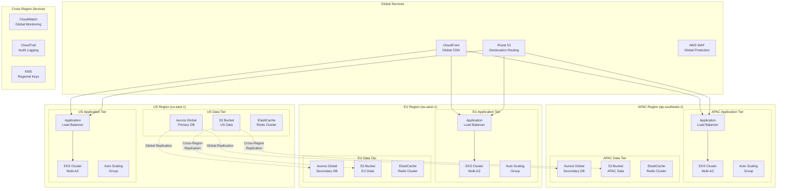

# Multi-Region Deployment Strategy for Global Applications

## Question
Create a multi-region deployment strategy for a global application with data sovereignty requirements.

## Solution Overview

A multi-region deployment strategy for global applications must balance performance, availability, compliance, and cost while ensuring data sovereignty requirements are met across different jurisdictions.

## Architecture Components

### Core Infrastructure
- **Primary Regions**: US-East-1 (N. Virginia), EU-West-1 (Ireland), AP-Southeast-1 (Singapore)
- **Secondary Regions**: US-West-2 (Oregon), EU-Central-1 (Frankfurt), AP-Northeast-1 (Tokyo)
- **Global Services**: CloudFront, Route 53, WAF

### Data Sovereignty Compliance
- **Regional Data Isolation**: Customer data remains within designated geographic boundaries
- **Cross-Border Data Transfer Controls**: Encryption and auditing for any necessary data movement
- **Compliance Frameworks**: GDPR (EU), CCPA (California), PDPA (Singapore)

## Implementation Strategy

### 1. Global DNS and Traffic Routing
```
Route 53 → Geolocation Routing Policy
├── North America → US-East-1 (Primary), US-West-2 (Secondary)
├── Europe → EU-West-1 (Primary), EU-Central-1 (Secondary)
└── Asia Pacific → AP-Southeast-1 (Primary), AP-Northeast-1 (Secondary)
```

### 2. Application Layer Deployment
- **Container Orchestration**: EKS clusters in each region
- **Auto Scaling**: Regional ASGs with cross-AZ deployment
- **Load Balancing**: ALB with health checks and failover
- **Blue/Green Deployments**: CodeDeploy for zero-downtime updates

### 3. Data Strategy
- **Regional Databases**: Aurora Global Database with regional read replicas
- **Data Classification**: 
  - **Sovereign Data**: Customer PII, financial records (region-locked)
  - **Global Data**: Product catalogs, static content (replicated)
  - **Operational Data**: Logs, metrics (regional with selective replication)

### 4. Content Delivery
- **CloudFront Distributions**: 
  - Regional origins for sovereign content
  - Global origins for non-sensitive static assets
  - Custom headers for data classification

## Architecture Diagram



## Data Sovereignty Implementation

### Regional Data Classification
| Data Type | Storage Location | Replication | Compliance |
|-----------|-----------------|-------------|------------|
| Customer PII | Regional only | None | GDPR, CCPA, PDPA |
| Financial Data | Regional + Backup | Encrypted | PCI-DSS |
| Application Logs | Regional | Selective | Local regulations |
| Product Catalog | Global | Full | Non-sensitive |

### Compliance Controls
- **Data Residency**: S3 bucket policies preventing cross-border transfer
- **Encryption**: KMS regional keys for data at rest
- **Access Controls**: IAM policies with geographic restrictions
- **Audit Trail**: CloudTrail logs for all data access

## Failover and Disaster Recovery

### Automated Failover
1. **Health Checks**: Route 53 health checks on each region
2. **DNS Failover**: Automatic traffic routing to healthy regions
3. **Data Sync**: Aurora Global Database handles read replica promotion
4. **Application Recovery**: EKS deployments with cross-AZ redundancy

### Manual Disaster Recovery
1. **Regional Failure**: Promote Aurora read replica in secondary region
2. **Data Recovery**: S3 Cross-Region Replication for backups
3. **Application Deployment**: CodePipeline triggers in backup regions
4. **Traffic Cutover**: Route 53 weighted routing for gradual migration

## Security Considerations

### Network Security
- **VPC Peering**: Secure inter-region communication
- **Transit Gateway**: Hub-and-spoke connectivity model
- **Security Groups**: Regional security policies
- **NACLs**: Network-level access controls

### Identity and Access Management
- **Cross-Region Roles**: IAM roles for regional resource access
- **Federation**: SAML/OIDC for global user authentication
- **MFA**: Multi-factor authentication enforcement
- **Audit Logging**: Comprehensive access logging across regions

## Cost Optimization

### Strategies
- **Reserved Instances**: Regional commitment discounts
- **Spot Instances**: Cost-effective compute for non-critical workloads
- **S3 Intelligent Tiering**: Automatic cost optimization for storage
- **Data Transfer Optimization**: Minimize cross-region data movement

### Monitoring and Alerts
- **Cost Explorer**: Regional cost breakdown and trends
- **Budgets**: Alert thresholds for unexpected costs
- **Trusted Advisor**: Cost optimization recommendations
- **Custom Metrics**: Application-specific cost tracking

## Deployment Pipeline

### CI/CD Strategy
1. **Source Control**: CodeCommit with regional repositories
2. **Build Process**: CodeBuild with regional build projects
3. **Deployment**: CodePipeline with regional deployment stages
4. **Testing**: Automated testing in each target region
5. **Rollback**: Automated rollback mechanisms per region

## Monitoring and Observability

### Global Monitoring
- **CloudWatch**: Regional metrics aggregated globally
- **X-Ray**: Distributed tracing across regions
- **Application Insights**: Custom application metrics
- **Synthetic Monitoring**: Proactive health checks

This architecture ensures compliance with data sovereignty requirements while providing high availability, performance, and scalability for a global application deployment.
