# Performance & Scalability Solutions

## 1. Database Performance Optimization

### Question
An application is experiencing slow database queries. What AWS services and strategies would you use to optimize performance?

### Solution Strategy

#### Immediate Actions
1. **Query Analysis**: Use Performance Insights to identify slow queries
2. **Index Optimization**: Create appropriate indexes for frequent queries
3. **Query Rewriting**: Optimize SQL queries and eliminate N+1 problems
4. **Connection Pooling**: Implement connection pooling with RDS Proxy

#### AWS Services for Database Optimization
- **Amazon RDS Performance Insights**: Query performance monitoring
- **Amazon RDS Proxy**: Connection pooling and management
- **Amazon ElastiCache**: Redis/Memcached for caching
- **Amazon Aurora**: Auto-scaling and performance features
- **Amazon RedShift**: For analytical workloads

### Database Optimization Architecture

---

## 2. Traffic Spike Handling

### Question
Design a solution to handle sudden traffic spikes (e.g., Black Friday) for an e-commerce site.

### Auto-Scaling Architecture

#### Components
- **Application Load Balancer**: Distributes traffic across instances
- **Auto Scaling Groups**: Dynamic EC2 instance scaling
- **Target Tracking**: CPU, memory, and custom metric scaling
- **Predictive Scaling**: ML-based scaling for known patterns

### Traffic Spike Handling Architecture

```mermaid
graph TB
    subgraph "Global Distribution"
        CF[CloudFront<br/>Global CDN]
        R53[Route 53<br/>DNS & Health Checks]
    end
    
    subgraph "Load Balancing"
        WAF[AWS WAF<br/>DDoS Protection]
        ALB[Application<br/>Load Balancer]
    end
    
    subgraph "Auto Scaling Application Tier"
        ASG[Auto Scaling Group<br/>EC2 Instances]
        ECS[ECS Fargate<br/>Containers]
        LAMBDA[Lambda<br/>Serverless Functions]
    end
    
    subgraph "Caching Strategy"
        EDGE[CloudFront<br/>Edge Caches]
        REDIS[ElastiCache<br/>Redis Cluster]
        DAX[DynamoDB<br/>Accelerator]
    end
    
    subgraph "Database Scaling"
        RDS[Aurora Serverless<br/>Auto-scaling DB]
        DYNAMO[DynamoDB<br/>On-demand Scaling]
    end
    
    subgraph "Monitoring & Scaling"
        CW[CloudWatch<br/>Metrics & Alarms]
        AS[Auto Scaling<br/>Policies]
        PREDICTIVE[Predictive<br/>Scaling]
    end
    
    CF --> WAF
    WAF --> ALB
    ALB --> ASG
    ALB --> ECS
    ALB --> LAMBDA
    
    ASG --> REDIS
    ECS --> DAX
    LAMBDA --> DYNAMO
    
    CW --> AS
    AS --> ASG
    PREDICTIVE --> ASG
    
    ASG --> RDS
    ECS --> RDS
```

#### Scaling Strategies
1. **Predictive Scaling**: Use historical data to pre-scale for known events
2. **Target Tracking**: Scale based on CPU, memory, or custom metrics
3. **Step Scaling**: Gradual scaling based on CloudWatch alarms
4. **Scheduled Scaling**: Time-based scaling for predictable patterns

---

## 3. Multi-Layer Caching Strategy

### Question
How would you implement caching at different layers of your application?

### Caching Layers
1. **Browser/Client Cache**: Static assets, API responses
2. **CDN Cache**: CloudFront edge locations
3. **Load Balancer Cache**: ALB sticky sessions
4. **Application Cache**: In-memory application cache
5. **Database Cache**: Query result caching
6. **Distributed Cache**: Redis/Memcached clusters

### Multi-Layer Caching Architecture

#### Cache Strategy Matrix
| Layer | Technology | TTL | Use Case | Invalidation |
|-------|------------|-----|----------|--------------|
| Browser | HTTP Headers | Hours-Days | Static assets | Version-based |
| CDN | CloudFront | Minutes-Hours | Content delivery | Path-based |
| Application | In-memory | Seconds-Minutes | Session data | Event-driven |
| Distributed | Redis/Memcached | Minutes-Hours | Shared cache | Key-based |
| Database | Query cache | Seconds-Minutes | Query results | Auto-expire |

---

## 4. Cost Optimization for Variable Traffic

### Question
Explain how you would optimize costs for a workload with predictable and unpredictable traffic patterns.

### Cost Optimization Strategy

#### For Predictable Traffic
1. **Reserved Instances**: 1-3 year commitments for base load
2. **Scheduled Scaling**: Time-based scaling for known patterns
3. **Savings Plans**: Flexible commitment-based discounts
4. **Spot Instances**: Cost-effective for fault-tolerant workloads

#### For Unpredictable Traffic
1. **Auto Scaling**: Dynamic scaling based on demand
2. **Serverless**: Pay-per-use Lambda functions
3. **Container Orchestration**: ECS/EKS with Fargate
4. **On-Demand Instances**: Flexible compute capacity

### Cost-Optimized Architecture

#### Cost Optimization Techniques

##### Instance Optimization
- **Mixed Instance Types**: Combine different instance sizes in ASG
- **Spot Fleet**: Use spot instances for non-critical workloads
- **Right Sizing**: Regularly review and adjust instance sizes
- **Instance Scheduler**: Stop/start instances during off-hours

##### Storage Optimization
- **S3 Intelligent Tiering**: Automatic cost optimization
- **EBS GP3**: Better price-performance than GP2
- **Lifecycle Policies**: Move data to cheaper storage classes
- **Data Compression**: Reduce storage and transfer costs

##### Network Optimization
- **CloudFront**: Reduce data transfer costs
- **VPC Endpoints**: Eliminate NAT gateway costs
- **Regional Optimization**: Place resources closer to users
- **Data Transfer Optimization**: Minimize cross-AZ transfers

### Monitoring and Alerting
- **Cost Budgets**: Set spending limits with notifications
- **Anomaly Detection**: Identify unusual spending patterns
- **Resource Tagging**: Track costs by department/project
- **Regular Reviews**: Monthly cost optimization assessments

This comprehensive approach ensures optimal performance and cost efficiency for both predictable and unpredictable traffic patterns while maintaining high availability and scalability.
