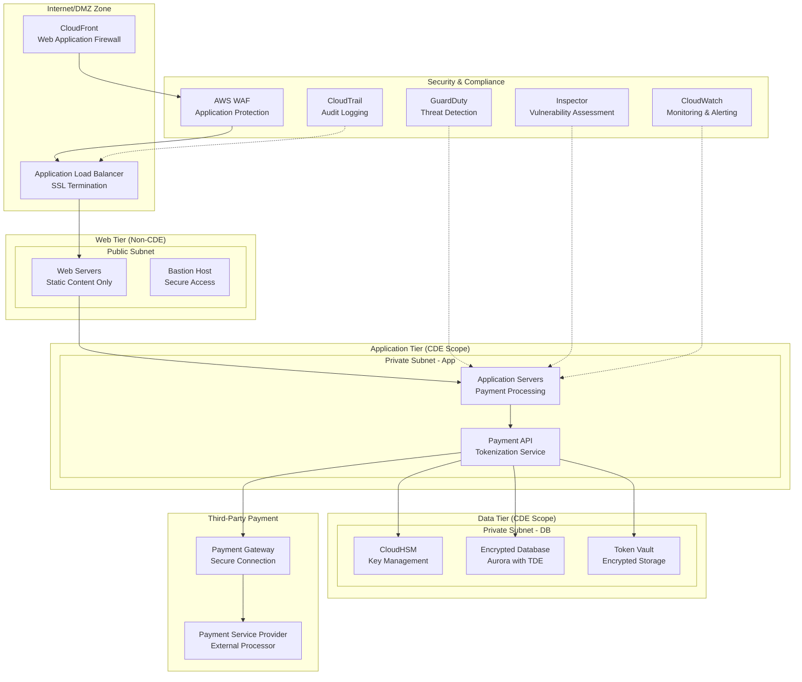
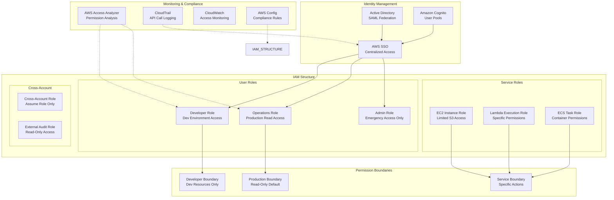
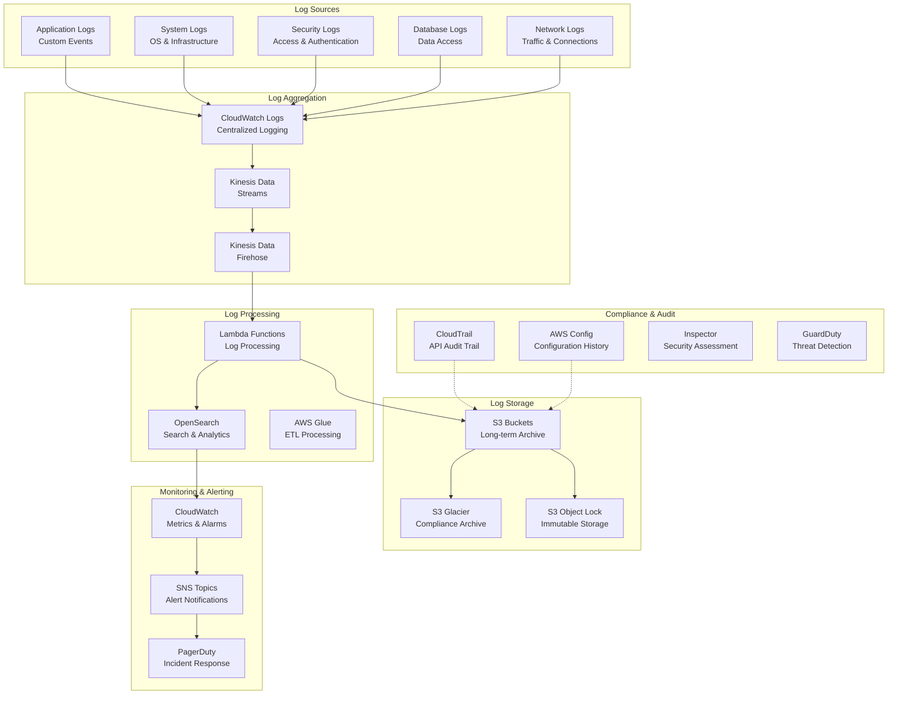

# Security & Compliance Solutions

## 1. PCI-DSS Compliant Payment Processing Architecture

### Question
Design a secure architecture for handling PCI-DSS compliant payment processing.

### PCI-DSS Requirements Overview
- **Build and Maintain Secure Networks**: Firewalls, secure configurations
- **Protect Cardholder Data**: Encryption, access controls
- **Maintain Vulnerability Management**: Regular updates, antivirus
- **Implement Strong Access Control**: Unique IDs, restricted access
- **Regularly Monitor Networks**: Logging, monitoring
- **Maintain Information Security Policy**: Documented procedures

### PCI-DSS Compliant Architecture



### Security Controls Implementation

#### Network Segmentation
- **VPC Design**: Separate subnets for web, app, and data tiers
- **Security Groups**: Restrictive inbound/outbound rules
- **NACLs**: Network-level access control lists
- **Private Subnets**: Database and payment processing isolated

#### Encryption Standards
- **Data at Rest**: AES-256 encryption for all stored data
- **Data in Transit**: TLS 1.2+ for all communications
- **Key Management**: AWS CloudHSM for key storage and operations
- **Database Encryption**: Aurora with Transparent Data Encryption (TDE)

#### Access Controls
- **IAM Roles**: Principle of least privilege
- **MFA**: Multi-factor authentication required
- **Session Management**: Secure session handling
- **Admin Access**: Bastion host with audit logging

---

## 2. Principle of Least Privilege Implementation

### Question
How would you implement the principle of least privilege across your AWS infrastructure?

### Least Privilege Strategy
1. **Role-Based Access Control (RBAC)**: Define roles based on job functions
2. **Resource-Based Permissions**: Grant access to specific resources only
3. **Temporary Credentials**: Use STS for temporary access
4. **Regular Access Reviews**: Periodic permission audits

### Least Privilege Architecture



### Implementation Best Practices

#### IAM Policy Design
```json
{
  "Version": "2012-10-17",
  "Statement": [
    {
      "Effect": "Allow",
      "Action": [
        "s3:GetObject"
      ],
      "Resource": "arn:aws:s3:::company-dev-bucket/*",
      "Condition": {
        "StringEquals": {
          "s3:ExistingObjectTag/Department": "${aws:PrincipalTag/Department}"
        }
      }
    }
  ]
}
```

#### Permission Boundaries
- **Developer Boundary**: Limits access to development resources
- **Service Boundary**: Restricts service-to-service communications
- **Time-Based Access**: Temporary elevated permissions
- **Conditional Access**: Context-based permission grants

---

## 3. SOC 2 Compliance Logging and Monitoring

### Question
Design a logging and monitoring strategy that meets SOC 2 compliance requirements.

### SOC 2 Trust Criteria
- **Security**: Protection against unauthorized access
- **Availability**: System operation and usability
- **Processing Integrity**: Complete, valid, accurate processing
- **Confidentiality**: Information designated as confidential
- **Privacy**: Personal information collection and processing

### SOC 2 Compliant Logging Architecture



### Compliance Requirements Mapping

#### Security Logging
- **Authentication Events**: All login attempts and failures
- **Authorization Changes**: Permission modifications
- **Data Access**: Database queries and file access
- **Configuration Changes**: Infrastructure modifications
- **Security Events**: Intrusion attempts and violations

#### Monitoring Requirements
- **Real-time Alerting**: Critical security events
- **Anomaly Detection**: Unusual access patterns
- **Performance Monitoring**: System availability metrics
- **Compliance Dashboards**: SOC 2 control evidence

---

## 4. Data Encryption Strategy

### Question
How would you secure data in transit and at rest across all AWS services?

### Encryption Strategy Overview
- **Data at Rest**: Encrypt all stored data using strong encryption
- **Data in Transit**: Protect data during transmission
- **Key Management**: Centralized and secure key handling
- **Compliance**: Meet regulatory requirements (FIPS 140-2, Common Criteria)

### Comprehensive Encryption Architecture

```mermaid
graph TB
    subgraph "Key Management"
        KMS[AWS KMS<br/>Key Management Service]
        HSM[CloudHSM<br/>Hardware Security Module]
        CMEK[Customer Managed<br/>Encryption Keys]
        ENVELOPE[Envelope Encryption<br/>Data Key Management]
    end
    
    subgraph "Data at Rest Encryption"
        subgraph "Storage Services"
            S3_ENC[S3 Server-Side<br/>Encryption (SSE)]
            EBS_ENC[EBS Volume<br/>Encryption]
            EFS_ENC[EFS File System<br/>Encryption]
        end
        
        subgraph "Database Encryption"
            RDS_TDE[RDS Transparent<br/>Data Encryption]
            DYNAMO_ENC[DynamoDB<br/>Encryption at Rest]
            REDSHIFT_ENC[Redshift<br/>Column-Level Encryption]
        end
    end
    
    subgraph "Data in Transit Encryption"
        subgraph "Network Layer"
            TLS[TLS 1.2+<br/>HTTPS/SSL]
            VPN[VPN Connections<br/>IPSec Tunnels]
            DIRECTCONNECT[Direct Connect<br/>MACsec Encryption]
        end
        
        subgraph "Application Layer"
            API_TLS[API Gateway<br/>TLS Termination]
            ALB_TLS[Load Balancer<br/>SSL/TLS Offload]
            CF_TLS[CloudFront<br/>Edge Encryption]
        end
    end
    
    subgraph "Application-Level Encryption"
        CLIENT_SIDE[Client-Side<br/>Encryption]
        FIELD_LEVEL[Field-Level<br/>Encryption]
        TOKENIZATION[Data<br/>Tokenization]
    end
    
    subgraph "Certificate Management"
        ACM[AWS Certificate<br/>Manager]
        PRIVATE_CA[AWS Private<br/>Certificate Authority]
        CERT_ROTATION[Automatic<br/>Certificate Rotation]
    end
    
    KMS --> S3_ENC
    KMS --> EBS_ENC
    KMS --> EFS_ENC
    KMS --> RDS_TDE
    KMS --> DYNAMO_ENC
    
    HSM --> REDSHIFT_ENC
    HSM --> TOKENIZATION
    
    CMEK --> KMS
    ENVELOPE --> KMS
    
    ACM --> API_TLS
    ACM --> ALB_TLS
    ACM --> CF_TLS
    
    PRIVATE_CA --> VPN
    PRIVATE_CA --> DIRECTCONNECT
    
    CLIENT_SIDE --> FIELD_LEVEL
    FIELD_LEVEL --> TOKENIZATION
```

### Encryption Implementation Details

#### Data at Rest Encryption Standards

##### Storage Encryption
- **S3 Encryption**: SSE-S3 (AES-256), SSE-KMS, SSE-C options
- **EBS Encryption**: AES-256 with KMS keys
- **EFS Encryption**: In-transit and at-rest encryption
- **Snapshot Encryption**: Automatic encryption of EBS snapshots

##### Database Encryption
- **RDS**: Transparent Data Encryption (TDE) with KMS
- **DynamoDB**: Server-side encryption with KMS or DynamoDB managed keys
- **Aurora**: Encryption at rest with performance optimization
- **Redshift**: Column-level encryption with hardware acceleration

#### Data in Transit Encryption Standards

##### Network-Level Protection
- **TLS 1.2+**: Minimum encryption standard for all connections
- **Perfect Forward Secrecy**: Ephemeral key exchange (ECDHE)
- **Strong Cipher Suites**: AES-GCM, ChaCha20-Poly1305
- **HSTS**: HTTP Strict Transport Security headers

##### VPC Network Encryption
- **VPN Connections**: IPSec with AES-256 encryption
- **Direct Connect**: MACsec for Layer 2 encryption
- **VPC Peering**: Encrypted inter-VPC communication
- **Transit Gateway**: Encrypted multi-VPC connectivity

#### Key Management Best Practices

##### KMS Key Policies
```json
{
  "Version": "2012-10-17",
  "Statement": [
    {
      "Sid": "EnableDecryptionForSpecificRole",
      "Effect": "Allow",
      "Principal": {
        "AWS": "arn:aws:iam::ACCOUNT:role/DataProcessingRole"
      },
      "Action": [
        "kms:Decrypt",
        "kms:GenerateDataKey"
      ],
      "Resource": "*",
      "Condition": {
        "StringEquals": {
          "kms:ViaService": "s3.us-east-1.amazonaws.com"
        }
      }
    }
  ]
}
```

##### Key Rotation Strategy
- **Automatic Rotation**: Annual KMS key rotation
- **Manual Rotation**: Critical keys rotated quarterly
- **Emergency Rotation**: Immediate rotation for compromised keys
- **Audit Trail**: Complete key usage logging via CloudTrail

#### Application-Level Encryption

##### Client-Side Encryption
- **S3 Client-Side**: Encrypt before upload using AWS SDK
- **Database Client-Side**: Application-level field encryption
- **API Payload Encryption**: End-to-end message encryption
- **Mobile App Encryption**: Local data encryption on devices

##### Field-Level Encryption
- **CloudFront**: Real-time field-level encryption at edge
- **API Gateway**: Request/response field encryption
- **Database Fields**: Column-level encryption for sensitive data
- **Log Field Encryption**: Sensitive data in application logs

### Certificate Management Strategy

#### SSL/TLS Certificate Lifecycle
- **Certificate Provisioning**: Automated via ACM
- **Validation**: DNS or HTTP validation methods
- **Deployment**: Automatic deployment to supported services
- **Renewal**: Automatic renewal 60 days before expiration
- **Monitoring**: Certificate expiration monitoring and alerting

#### Private Certificate Authority
- **Internal Services**: Private CA for internal communications
- **Device Certificates**: Client certificate authentication
- **Code Signing**: Application and container signing
- **Compliance**: Meet regulatory requirements for certificate management

### Encryption Monitoring and Compliance

#### Monitoring Requirements
- **Encryption Status**: Monitor all resources for encryption compliance
- **Key Usage**: Track KMS key usage and access patterns
- **Certificate Health**: Monitor SSL certificate status and expiration
- **Compliance Reporting**: Generate encryption compliance reports

#### Audit and Compliance
- **CloudTrail Integration**: Log all KMS key operations
- **Config Rules**: Automated compliance checking
- **Security Hub**: Centralized security findings
- **Inspector**: Vulnerability assessment including encryption

This comprehensive encryption strategy ensures that all data is protected both at rest and in transit, with proper key management and certificate handling to meet the highest security and compliance standards.
